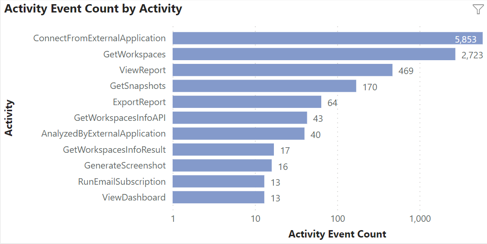

## Optimize and protect your existing Power BI environment

Are some of your reports slow? Are you spending more money than you need to for cloud services? Viewing reports and performing data analysis can frustrate users when the platform performance is slow. User adoption can suffer due to identifiable environment fixes, report design flaws, and data modeling problems. Determining performance bottlenecks and data governance issues in a complex system can take a long time. Solliance has built tools and leverages Microsoft services to identify performance and governance problems across your entire Power BI tenant. You will be able to spot critical areas of concern and reports that require additional investigation.

Administrators can easily spot divergent data policy behaviors and address them before they become costly organizational mistakes. Data-driven conversations about Power BI resource usage are now possible with developers and leadership. Administrators can develop usage profiles and performance trend analysis proactively instead of waiting for community complaints and environment outages. IT cloud provider budgets can be more accurate based on a current and projected usage profile.

## Assess your Power BI tenant

Step 1 - Develop a Power BI environment artifact and usage profile. Be able to answer questions like:

- How many workspaces, datasets, and reports make up your environment? What type of data are users creating reports from?
- How many users are in your tenant, what types of activities are they performing, and how often?
- What day of the week and time are the users performing those activities?
- What report access and workspace roles are assigned in your environment?
- Which reports are consuming your capacity and driving compute costs?

Step 2 - Assess your current Power BI tenant for performance and improvement suggestions based on your reporting and data processing usage. Understand where your environment resources are being used and spent. Learn who is consuming resources and driving your cloud service consumption expenses. Additional training and design awareness could save your company thousands of dollars monthly.

Step 3 - Let's work together to develop or refine a plan based on your organization's data analysis requirements and resource budget. Train users and developers on best practices and environment usage guidelines.

Our experts can fine-tune your environment to provide the optimal user experience.
