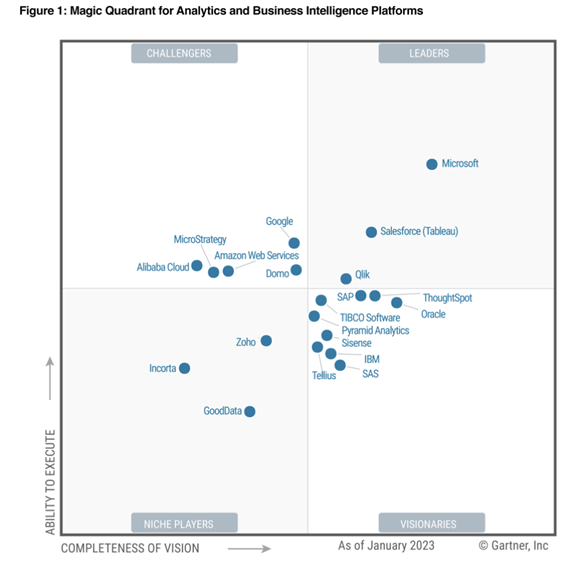
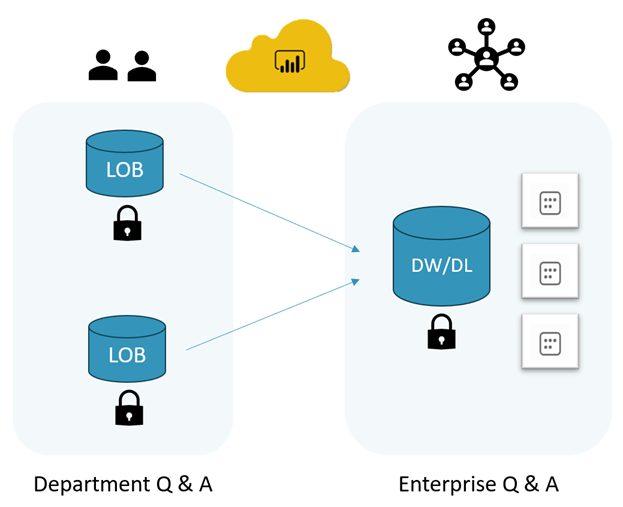
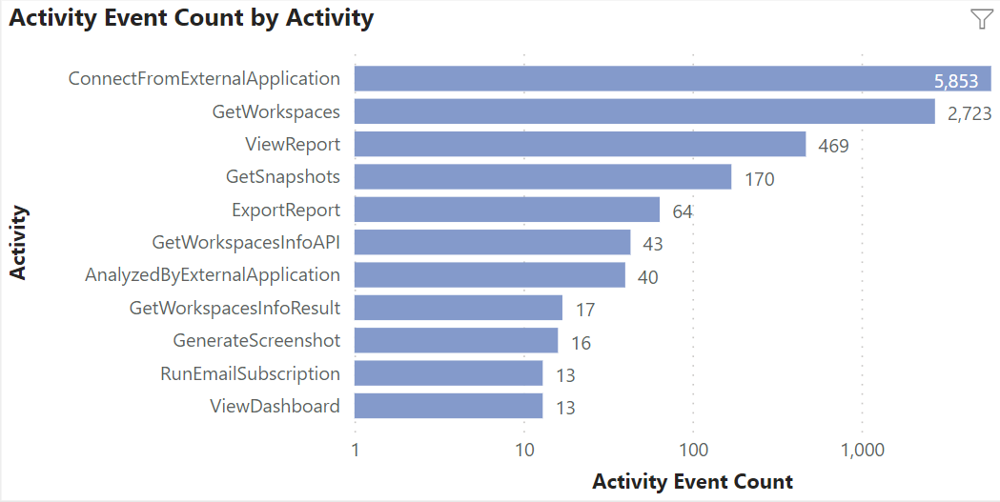

# Solliance BI Services

At Solliance, we help companies operate more efficiently by creating
scalable enterprise business intelligence (BI) infrastructure and
visually appealing reports that scale with your performance needs. Our
analysts, engineers, and data scientists will explore your business
domain and organization's data to help reveal hidden insights and
trends. We are focused on supporting a successful data culture.

Building a capable data culture and platform occurs in phases. We can
create a customized BI maturity roadmap, allowing your organization to
evolve at the optimum speed. As your expert BI partner, we make it
possible for your analysts and users to answer priority business
questions and take action based on derived data insights quickly.

## Migrate to a modern BI platform

Solliance will partner with your organization to implement your
end-to-end BI solution. Whether your data lives in Excel spreadsheets, a
SaaS environment, or enterprise cloud database providers, we can
customize an architecture and a plan to migrate/integrate your data into
a high performance data serving layer.

Great reports require current data and need to be enhanced to answer
current and new business questions. Your business environment keeps
changing, and so will your reporting needs. Users need to focus on
important facts quickly and explore the data to answer new business
questions and unlock hidden insights. That task can be challenging if
your BI tools lack modern features or if your organization utilizes
multiple BI tools. Reduce license and support costs. Standardize on a
platform that is rated number one its market segment. Solliance can
migrate your organization to the powerful Power BI platform.

## Migrate from Excel to Power BI

Ready to migrate from Excel to Power BI reports? It depends on your
needs. How much data are you processing, and what are your report
collaboration needs? Excel allows for great dataset definition
flexibility, data exploration, and proof of concept (POC) modeling. Once
your POC model is complete, consider migrating the data model and
visualizations to a scalable BI platform like Power BI.

As dataset sizes grow and collaboration needs evolve, Power BI can
process your data quickly and share reports securely. Processing larger
more complex data is no longer constrained by a user's desktop hardware.
Automated data refresh schedules make it easy to configure refresh
schedules to match your company's needs. Avoid the manual steps for
report distribution and collaboration. Free your resources from
repetitive low-value copy-paste tasks.

Solliance will migrate your key spreadsheets and data processing into a
central data-serving repository using a modern automated workflow. Your
report users will have valid fresh data all the time without executing
manual tasks. Power BI's Vertipaq engine provides fast data processing,
allowing for high performant visualization rendering.

## Centralize your data and calculations into a single source of truth

Important organization data can be located in multiple data source
locations. Manually exporting and importing data from the application
into the reporting platform can be time consuming and error prone. Power
BI and Azure services makes data ingestion, modeling, and rapid report
development easier. With over 90 data provider connectors, Solliance can
automate data importing from many of the top data serving platforms on
an automatic scheduled basis. Bringing the data into a central data
repository provides a single source of truth, line-of-business (LOB)
vendor independence, and allows users to ask more complex questions
across different data domains. No longer will they be limited to one LOB
application data. They can get enterprise answers.

Once your team validates key calculations, make them available to the
rest of the organization. Let other team members create new reports from
a known certified dataset. Create and increase the ability for user
self-service BI solutions and reduce the barrier for a thriving
organizational data culture.

## Build self-service data models

Creating great reports fast depends on an easy-to-understand validated
data model. Our team can create clean data models and measures that
empower analysts and users to create appealing, accurate reports
independently. Solliance believes in the self-service BI experience. We
discover, validate, and optimize the data relationships for the best
report performance and key data insights.

## Report and dashboard development

Solliance's Power BI experts and data scientists specialize in data
visualization and report design. Through close collaboration, we will
turn your organization goals into reports that focus on key data
performance indicators, data influencers, and insights. We listen
closely to stakeholder feedback and analyze the data. Reports are
refined to match users' expectations. Great reports enable faster, more
accurate decision-making based on the most current and relevant data.

## Ask an Expert and get the training you need

Solliance wants to make sure our clients can create their own reports
and manage their Power BI and Azure environment. We will provide end of
project documentation and training materials to make sure you have the
necessary materials for continued success. Our assistance does not end
there.

We offer on-site and remote Power BI/Azure training opportunities.

Subject areas include:

1.  Introduction to Power BI
2.  Data modeling for analysts
3.  Power Query: Data cleaning and transformation
4.  Developing DAX measures
5.  Developing and deploying reports
6.  Monitoring your Power BI tenant and Azure resources

Customized learning paths are available upon request.

Once trained, your organization can leverage the Power BI and Azure
services to the fullest.

## Optimize and protect your existing Power BI environment

Are some of your reports slow? Are you spending more money than you need
to for cloud services? Viewing reports and performing data analysis can
frustrate users when the platform performance is slow. User adoption can
suffer due to identifiable environment fixes, report design flaws, and
data modeling problems. Determining performance bottlenecks and data
governance issues in a complex system can take a long time. Solliance
has built tools and leverages Microsoft services to identify performance
and governance problems across your entire Power BI tenant. You will be
able to spot critical areas of concern and reports that require
additional investigation.

Administrators can easily spot divergent data policy behaviors and
address them before they become costly organizational mistakes.
Data-driven conversations about Power BI resource usage are now possible
with developers and leadership. Administrators can develop usage
profiles and performance trend analysis proactively instead of waiting
for community complaints and environment outages. IT cloud provider
budgets can be more accurate based on a current and projected usage
profile.

## Assess your Power BI tenant

Step 1 - Develop a Power BI environment artifact and usage profile. Be
able to answer questions like:

-   How many workspaces, datasets, and reports make up your environment?
    What type of data are users creating reports from?
-   How many users are in your tenant, what types of activities are they
    performing, and how often?
-   What day of the week and time are the users performing those
    activities?
-   What report access and workspace roles are assigned in your
    environment?
-   Which reports are consuming your capacity and driving compute costs?

Step 2 - Assess your current Power BI tenant for performance and
improvement suggestions based on your reporting and data processing
usage. Understand where your environment resources are being used and
spent. Learn who is consuming resources and driving your cloud service
consumption expenses. Additional training and design awareness could
save your company thousands of dollars monthly.

Step 3 - Let's work together to develop or refine a plan based on your
organization's data analysis requirements and resource budget. Train
users and developers on best practices and environment usage guidelines.

Our experts can fine-tune your environment to provide the optimal user
experience.

## Embed Power BI reports into your applications

Reduce your tool footprint and development/support costs. Once your team
learns how to create great Power BI reports, leverage that skill set
throughout the organization. Power BI reports can seamlessly be embedded
in Office 365 applications like PowerPoint and SharePoint. Allow your
colleagues to master the toolset and leverage their work in multiple
areas. Get support assistance from the Power BI experts and peer
community [Power BI Fabric Community support
site](https://community.fabric.microsoft.com/t5/Microsoft-Power-BI-Community).

What about embedding reports into my custom web applications? Migrating
from custom web application reports to Power BI embedded reports offers
a host of compelling advantages. Power BI is a robust and widely
recognized business intelligence tool, known for its user-friendly
interface, and powerful scalable analytical capabilities. By leveraging
Power BI embedded reports, you can provide your users with a more
intuitive and visually appealing reporting experience without relying
completely on developers. The same reports users and analysts create can
be embedded in your web app.

Power BI offers many data visualization options, making it easy to
present complex data in an easy and understandable manner. Power BI's
integration capabilities allow for seamless embedding within your
existing web applications, ensuring a cohesive and unified user
experience. Simplify report creation and maintenance by leveraging
pre-built templates and interactive visualizations. Additionally, Power
BI's continuous monthly updates and support from Microsoft guarantees
your reporting capabilities remain cutting-edge. No longer will you be
bound to custom software installations and versions that are updated
infrequently.

At Solliance, we can help navigate the environment design,
configuration, and licensing to meet capacity and budget needs. We can
help guide your developers through the application report integration
process that gives your application users a unified secure reporting
experience.

## Data-driven alerts

What good are great reports and insights if no one views them
consistently? What if there was a way to draw target report users'
attention proactively when data events pass a threshold? Leverage the
same Power BI artifacts for data-driven alerts. Solliance can create
data-driven alerts based on critical Power BI measure thresholds. Once a
threshold is reached, a notification can be sent out to report users
with a link back to the Power BI report. Monitoring these data events
increases report usage and the likelihood users will take action on
organization key performance indicators.

## Data Security

Do you know where your data comes from, how it is evolving, and who is
accessing it? Are there restrictions on how it should be shared?
Solliance can help you craft a governance and data policy that allows
your team the freedom to create business reports while adhering the
organization's data security policy. Free up your engineering and
operation teams from time-consuming discovery and governance monitoring
tasks. Enable data stewards and owners to manage the environment
independently. Create reports on data access rights throughout your
tenant.

## Big Data reporting

Integrating, processing, and reporting on big data is a more challenging
project compared to other analytical projects. Without proper
architecture design, the data volume and velocity can overwhelm poorly
designed environments. Data refreshes and report calculations are slow.
Solliance has experience developing architecture and sizing
infrastructure that can handle big data needs. Whether its batch or
streaming data, we help clients ingest, process, and partition data for
optimal analytical performance.

## Report development methodology

Building a report with appealing visualizations is only a small part of
the overall process. What good is a report that does not focus on
answering the right question in the first place?

At Solliance, we focus on a holistic approach to creating a report. We
will guide your organization through answering preliminary questions
like:

1.  What are the near term priority business goals, and how are you
    measuring your performance/progress with data? When you understand
    the reporting focus, the data source requirements become clear. The
    data granularity, extraction, and processing requirements rise to
    the surface.
2.  What actions are your users taking after reviewing your reports?
    Reports provide value measurements of excellence and provide clarity
    regarding areas of deficiencies. Build reports with the actions
    users are going to take in mind.
3.  Who are the main stakeholders? Why should they care about your
    report? Even though a report has been developed, the target audience
    still needs to be invested for adoption to be guaranteed. Great
    reports require collaboration and should be customized to meet the
    stakeholders' prioritized use cases. The report design is affected
    greatly by the stakeholder profile and their needs.
4.  Where is the stakeholder most likely to view a report? e.g. Plant
    floor, desk, on a phone in a car. Target audiences may view their
    reports in different locations, devices, and formats. These critical
    requirements affect technology choices and report design.
5.  What does project success look like? Each project phase needs a
    success target. This target will serve as a stopping point to
    evaluate the current iteration's success.

Implementing a successful BI project entails more than deploying and
configuring technology. It is about knowing which organization questions
need to be answered and answering the right questions in the report. The
organization must believe in and value the report; leadership must
review and rely on the same report data. "*Don't expect what you don't
inspect.*"

## Data Integrations

Solliance's engineers can develop pipelines to automate your data
extraction and transformation tasks, whether your data is stored
on-premises, in Azure, or at other cloud providers. Multiple data
sources can be transformed into the optimal storage and analytical
format, making it ready for reports and machine learning processes. You
can implement an end-to-end analytics solution on a single platform. We
can solve your difficult integration challenges and let your
organization focus on deriving value from the reporting data.

Pipeline completion events do not mean new data has been loaded into
your environment successfully. Once are the pipelines operational,
Solliance can create post processing data checks. Custom rules will
validate your data and send alerts to administrators if data anomalies
exist. Don't wait for users to alert you the reports are broken.
